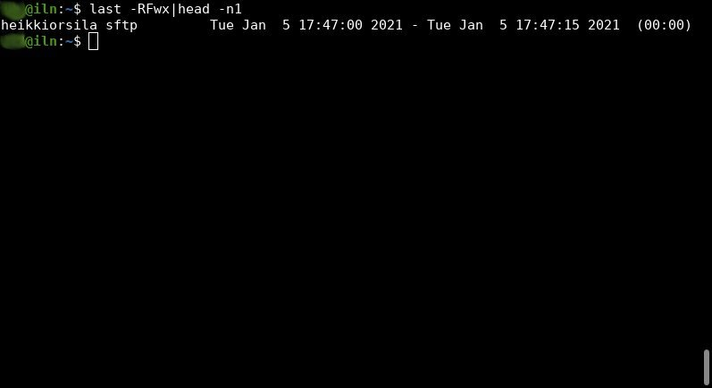

*sftpwrapper* is a tool that logs SFTP sessions into *wtmp* on GNU/Linux.
The tool makes SFTP sessions visible for commands like *w* and *last*.



# Introduction

OpenSSH server logs interactive SSH sessions into *utmp*/*wtmp* so that
users can view present and past sessions with commands like *w* and *last*.
Sessions without a TTY are not logged. And therefore, OpenSSH does not log
SFTP sessions into utmp/wtmp.

*sftpwrapper* tool enables administrators to make SFTP sessions loggable.
*sftpwrapper* takes over new SFTP sessions, logs new sessions and executes
the actual sftp-server under itself. When the session is done, *sftpwrapper*
logs the session as being over.

# Installation

## 0. Install dependencies

On Debian/Ubuntu, `build-essential` package is needed.
Specifically, C library headers (`libc-dev`) and
compiling tools (`gcc` and `make`) are needed.

## 1. Compile binaries:
```
$ make
```

## 2. Install binaries:

```
$ sudo make install
```

## 3. Enable sudo for /usr/local/bin/wtmplogger binary for users to log.

Every user that can login with ssh should be allowed to sudo execute
`/usr/local/bin/wtmplogger`. In web hosting services this group is often
www-data, but here *wtmploggers* is used as an example group name.
Edit sudo configs as follows:

```
$ sudoedit /etc/sudoers.d/wtmp-privilege
```

Insert the following line into `/etc/sudoers.d/wtmp-privilege`:

```
%wtmploggers    ALL = NOPASSWD: /usr/local/bin/wtmplogger
```

## 4. Change the following line in sshd_config from:

```
Subsystem sftp /usr/lib/openssh/sftp-server
```

to

```
Subsystem sftp /usr/local/bin/sftpwrapper -c SSH_CLIENT -- /usr/lib/openssh/sftp-server
```

# Debugging

* *sftpwrapper* writes any unexpected error/warning message into syslog

# Bugs and limitations

* Hardcoded executable paths for sudo and wtmplogger.
  These should be made configurable.

* Hardcoded parent process checking in wtmplogger.
  This should be made configurable.

* Only supports Linux /proc file system to get process information.
  Support for other platforms should be provided.

# Resources

* Please send any feedback to
[sftp and wtmp support thread](https://lists.mindrot.org/pipermail/openssh-unix-dev/2020-December/038984.html) at
[openssh-unix-dev mailing list](https://lists.mindrot.org/mailman/listinfo/openssh-unix-dev)
* For any bugs reports, feature requests, file an issue for this repository
* For any patches, create a PR for this repository

# Author

Copyright 2020 Seravo Oy.

The tool was written by Heikki Orsila \<heikki.orsila@iki.fi\>.
